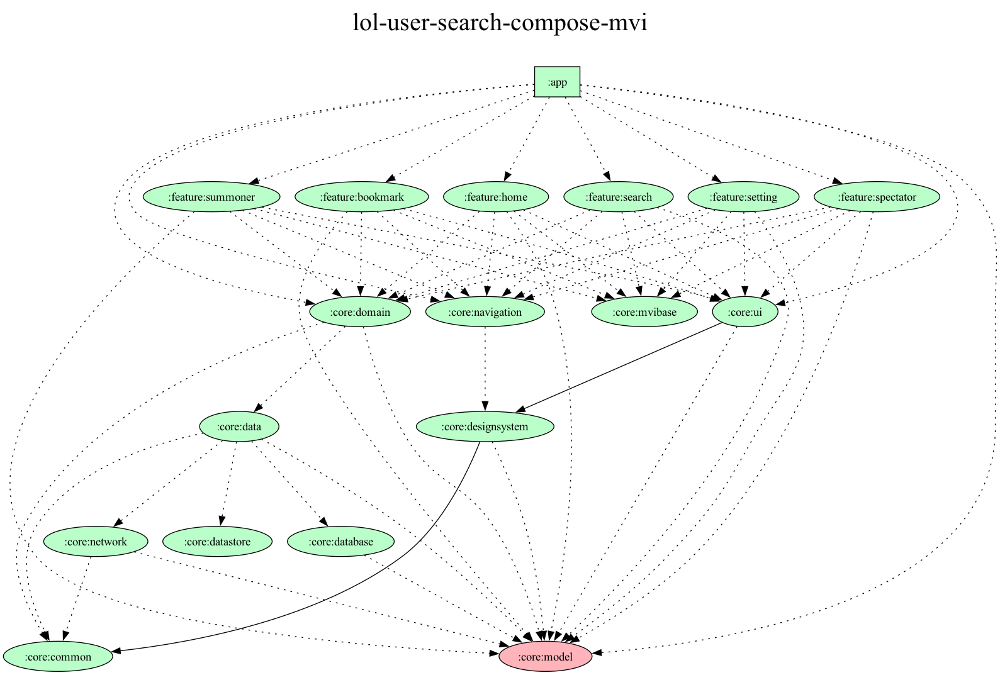

## 리그오브레전드 전적검색 및 실시간 게임정보(룬,스펠)확인 앱📱 

> Clean Architecture + MVI + Multi Module + Dagger-Hilt + Kotlin dsl

🛠️ CleanArchitecture, MVI-Pattern, Multi-Module, Compose, Kotlin-DSL, Dagger-Hilt

## Module Dependency Graph

https://github.com/plz-no-anr/lol-user-search-compose-mvi/assets/71485469/8c7b2686-3514-4b8d-b6c0-badba287c617
